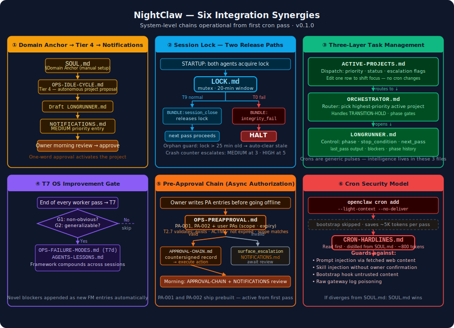

# NightClaw — Autonomous Overnight Agent Governance for OpenClaw

**NightClaw turns OpenClaw into a system that works for you while you sleep.**

You configure a domain focus. You go to sleep. NightClaw runs structured research passes overnight, builds on prior work across sessions, and surfaces a morning briefing of what it found, what decisions it needs from you, and what it wants to work on next. You read it in two minutes, say yes or no, and it runs again tonight.

---

## At a Glance

**What is OpenClaw?** An open-source AI agent runtime that gives an LLM a shell, a filesystem, scheduled cron tasks, and persistent memory — running on your own hardware. [250,000+ GitHub stars as of April 2026](https://github.com/openclaw/openclaw). This is what NightClaw runs on.

**What NightClaw adds:** A formal governance system with two enforcement layers working together: deterministic scripts that verify integrity cryptographically and validate structural consistency before sessions run; and natural-language protocols — typed object model, dependency graph, state machine sequences, indexed failure knowledge — the LLM reads and executes within those verified bounds.

**No Docker. No daemon. No database.** Deterministic scripts enforce hard bounds — SHA-256 integrity before every session, 96 structural consistency checks at deployment (`validate.sh`). Natural-language protocols define what the LLM executes within those bounds. Neither requires a daemon, database, or external service.

**Platform:** Any OS where OpenClaw runs — macOS, Ubuntu, Windows (WSL2), remote Linux server, cloud VM. There is nothing OS-specific in NightClaw itself. The install script requires `bash`, `sed`, `python3`, and `sha256sum` — all present by default on macOS and any Linux distribution.

**Cost:** NightClaw itself is free (MIT). Running it costs only your LLM API tokens — Ollama works at zero cost for evaluation; Claude Sonnet 4.5 or GPT-5 class models are recommended for autonomous production passes. Token baseline: ~2,400 tokens per cron pass startup + ~6,900 session floor (SOUL + AGENTS + WORKING + ACTIVE-PROJECTS). **Important:** OpenClaw's heartbeat runs separately from NightClaw's crons and can silently consume more tokens than all cron passes combined if left at default settings. See DEPLOY.md "Heartbeat Configuration" for recommended settings.

**Web search:** OpenClaw's native search tool uses DuckDuckGo with a hard limit of ~10–15 queries per session. This is sufficient for targeted research passes but will block under heavy query patterns. For higher-volume research workloads, configure the [SearXNG plugin](https://github.com/openclaw/openclaw/releases) (bundled in OpenClaw 2026.4.x) or a dedicated search API (Serper, Brave) in your OpenClaw setup before running research-heavy projects.

**What you actually see after setup:**

| File | What it shows |
|------|---------------|
| `NOTIFICATIONS.md` | Every proposal, blocker, and escalation the agent has surfaced — your daily inbox |
| `audit/AUDIT-LOG.md` | Append-only record of every action the agent took, with authorization and outcome |
| `audit/SESSION-REGISTRY.md` | Every cron run: model used, tokens consumed, projects touched, outcome |
| `ACTIVE-PROJECTS.md` | What the agent is working on and at what priority — edit this to shift focus |
| `PROJECTS/[slug]/LONGRUNNER.md` | Per-project control file: current phase, last pass, next pass objective, blockers |
| `memory/YYYY-MM-DD.md` | Structured log of what each pass actually did, written by the agent |

**Already have OpenClaw running?** See [Adding NightClaw to an Existing Workspace](#adding-nightclaw-to-an-existing-workspace) below.

> **⚠ NOTICE:** This framework was developed with AI assistance. It should be reviewed and adapted before use in any environment where failures could cause material harm. See the Disclaimers section.

> **Placeholders:** Files in this repo contain `{OWNER}`, `{WORKSPACE_ROOT}`, and similar tokens. These are intentional — `scripts/install.sh` substitutes them during setup. Do not edit them manually before running the install script.

---

## What This Is

Running a 24/7 autonomous agent is now trivially deployable. OpenClaw made it so — 250,000+ GitHub stars in four months — because it is the only general-purpose, self-hosted agent framework with cron-native scheduling and workspace-persistent memory built for continuous autonomous operation. Persistent agents that run without a human trigger solve a real problem completely. What OpenClaw does not solve is the morning after.

Your agent ran eight passes last night. All marked complete. The MEMORY.md file silently exceeded its bootstrap limit three days ago — the agent has been operating without its accumulated context ever since, and nothing logged this. One cron fired but hung; systemctl still reports active. The task that was supposed to finish phase three has no verifiable output assertion — the agent declared it done. You have no audit trail linking any decision to any authorization across the session boundary.

This is not hypothetical. r/openclaw documented every one of these failure modes in April 2026, with community-built solutions: dead-man’s switch timestamp files, `wc -c` file size watchers, SHA-256 bash scripts written by hand. Every serious 24/7 OpenClaw user is building their own version of NightClaw from scratch. NightClaw packages those patterns — and four that nobody had formalized yet. To our knowledge, NightClaw v0.1.0 is the first governance framework designed specifically for the operational model of a 24/7 persistent workspace-native agent.

---

**The first SHA-256 pre-session behavioral integrity gate.**

Before every cron session, before the LLM context is populated with a single token, a shell script running outside the LLM layer verifies SHA-256 hashes of all behavioral governance files listed in INTEGRITY-MANIFEST.md. Any drift — accidental edit, model-induced write, external modification — halts the session. Hard halt. Not a warning.

TPM pre-boot measurement chains have applied this principle to firmware since 2003. Before an OS loads, the TPM verifies the bootloader’s hash against a stored measurement. If anything changed, boot stops. The governed system does not run until the integrity of the layer governing it is confirmed. NightClaw applies the same pattern to behavioral governance files. The community discovered this need independently — `sha256sum` baseline scripts, nightly audit crons, manually maintained hash files. Advanced OpenClaw users were already building this from scratch. NightClaw formalizes it as a hard pre-session gate built into the framework itself. If the governance layer has drifted, the session does not start.

---

**The first typed dependency graph traversed deterministically before every workspace write.**

Every file in the workspace is a typed object. REGISTRY.md declares each one: field contracts (R2), write-routing tier (R3), dependency edges (R4), atomic bundle operations (R5), self-consistency invariants (R6). Before any write, PW-2 greps R4 for the target file’s outbound edges and surfaces every downstream dependent — via shell command, not LLM reasoning. The agent does not reason about what it might affect. The schema declares it. The grep computes it.

This is foreign key enforcement for a natural-language object model. In a relational database, a missing foreign key declaration breaks referential integrity silently. The record exists; the relationship doesn’t; queries return wrong results; nothing errors. NightClaw applies the same constraint: a missing R4 edge breaks the cascade silently. Files diverge. Nothing alerts. The difference is that REGISTRY.md makes the dependency graph explicit, inspectable, and enforced by a deterministic shell command. To our knowledge, no existing agent governance framework implements a workspace dependency graph. They implement access control lists. They implement tool-call interceptors. Typed relationships between governed objects with deterministic cascade traversal — that is new.

---

**The first FMEA-structured failure knowledge base in an autonomous agent’s live execution context, compounding from production.**

A growing registry of failure modes, structured as FMEA entries: detection signal, root cause, fix procedure, prevention. In the agent’s reasoning context before execution begins. Not an external error handler — a taxonomy the agent reads before it tries anything. New entries are added during operation as they’re encountered.

FMEA is how Boeing knows what to do when a hydraulic line fails mid-flight. You do not troubleshoot a 737 from first principles at 35,000 feet. You consult the classified failure taxonomy, follow the documented procedure, the system continues operating. The insight NightClaw applies is not FMEA itself — it is placing FMEA in the executor’s context so the executor diagnoses failure class before attempting recovery, not after being blocked by an external handler that cannot explain why. And it compounds: novel failures discovered in production are appended at T7d, so the knowledge base grows from the agent’s own runs. Every session that hits a new wall and recovers makes every subsequent session more capable of classifying that failure. The executed, in-context, self-compounding version ships in NightClaw v0.1.0.

---

**The first machine-testable stop condition for multi-session autonomous task execution.**

LONGRUNNER `stop_condition` is a verifiable assertion:

> *"A dated output file exists in PROJECTS/[slug]/outputs/ with at least 12 entries, each containing a name, pricing model, and user sentiment."*

Not *"when the research feels complete."* Not *"when the agent decides it’s done."* An assertion that either passes or it doesn’t. Completion is a check, not a judgment.

For single-session tasks, an LLM claiming false completion is a recoverable nuisance. For multi-day autonomous work spanning fourteen cron sessions with no human in the critical path, silent non-completion compounds badly — and it is specifically in this context that no governance framework had formalized a machine-testable stop-condition primitive.

Bertrand Meyer formalized Design by Contract in Eiffel in 1986. Post-conditions make program correctness verifiable rather than assumed. The LLM equivalent of a program that sets `result = true` without computing it is an agent that declares a task complete and moves on. The post-condition passes. The work is empty. Verifiable stop conditions eliminate this failure mode.

---

Security governance tools exist for OpenClaw — tool-call interception, permission scoping, organizational access control. Those tools solve real problems. NightClaw is orthogonal to all of them. It addresses the layer they do not touch: operational lifecycle across sessions. What phase is this project in. Is this task actually done. What happened across the last fourteen sessions. What was authorized, by whom, with what scope, across session boundaries.

None of these patterns were invented here. FMEA came from US military and aerospace reliability engineering (MIL-P-1629, 1949). SHA-256 from NSA. Dependency graphs from Edgar F. Codd’s relational model. Scoped authorization with expiry from OAuth2. Formal post-conditions from Meyer and Hoare. The contribution is applying them — for the first time — to the governance of a 24/7 persistent workspace-native agent, at the language layer where the agent’s own behavioral context lives.

Open source built this execution model. Open source is building the governance standard for it.

---

## The Problem This Solves

People are already running OpenClaw overnight. Crons are already set. The question isn’t whether to run an autonomous agent — it’s whether any of what it did is auditable, recoverable, or reviewable in the morning.

Marc Andreessen called YOLO mode and keeping logs the right instinct — "if you don’t give [the agent] a bank account, it’s just going to break into your bank account anyway and take your money" ([a16z / Latent Space Podcast, Apr 2026, ~55:49](https://podscripts.co/podcasts/a16z-podcast/marc-andreessen-on-ai-winters-and-agent-breakthroughs)). NemoClaw (NVIDIA’s runtime sandbox layer) answers the runtime sandbox question. **NightClaw answers the morning-after question** — what did the agent do, what did it decide, what failed, what’s it working on now, and what does it need from you before the next pass runs tonight.

The governance layer lives inside the workspace the agent already reads — the same markdown it reasons over natively. No external service. No separate infrastructure. No code.

This is not a simplification — it's the point. A governance layer the agent reads as its own context can contain dependency declarations, self-correction logic, and failure knowledge that an external enforcement system cannot. The agent reasons about the governance as it executes within it.

Concretely, OpenClaw ships with cron scheduling and LLM sessions. There is no native:
- Audit trail linking action → authorization → outcome
- Long-running task lifecycle management across multiple sessions
- Failure taxonomy or self-correction loop
- Schema drift detection for external data sources
- Structured surface for reviewing what the agent discovered overnight

---

## What You Get

**Audit trail** — what OpenClaw doesn't provide out of the box:
- Append-only action log with field-level change attribution — event sourcing pattern: nothing is overwritten, current state is always reconstructable from history
- Session registry tracking every worker and manager pass with token accounting
- Approval chain linking owner authorization → agent action → audit entry
- Session state drift detection via SHA-256 integrity manifest

**Long-running task lifecycle:**
- LONGRUNNER per-project control file — explicit pass boundaries, machine-testable stop conditions, retry state. Stop conditions are verifiable assertions — a check that either passes or it doesn't, not a subjective judgment. See the stop-condition example in [What This Is](#what-this-is) above.
- Phase-bound project lifecycle with formal state transitions: current phase → defined successor → phase history append-only
- Multi-project dispatch via priority-ranked table — shift focus by changing one number
- Manager review pass that surfaces direction problems before they compound

**Self-healing execution loop:**
- A continuously growing failure mode registry structured as FMEA entries — detection signal, root cause, fix procedure, prevention. Agent diagnoses before retrying, not after.
- Blocker decision tree: known failure mode → apply fix; pre-approved → act; partial completion possible → continue; none of the above → surface proposal, re-route. Designed to never halt on recoverable blockers — integrity failures halt by design.
- Novel blockers appended as new failure modes at T7d — the knowledge base grows from production experience so the same wall is never hit twice
- Quality gate (three-question test) preventing low-value output from being marked complete

**Human proposal surface and approval workflow:**
- Agent surfaces enhancement proposals to NOTIFICATIONS.md — non-blocking, async
- System continues working on everything it can while proposals await review
- Owner reviews at their own cadence (morning check is the natural touchpoint)
- Pre-approval system for pre-authorizing action classes before going offline
- Model tiering: approved enhancements can specify a different (higher-capability) model — cost categorized separately from routine execution

**Behavioral discipline** (not enforced security — honest framing):
- Hard Lines encoded as agent identity — behavioral defaults the agent internalizes as character
- Pre-write protocol gating every file write (PW-1–PW-5): scope check → PW-2 greps R4 dependency graph → execute → audit
- Cascade integrity — PW-2 traverses the declared dependency graph before any write; downstream dependents surface automatically, not from model reasoning
- Write tiers: APPEND, STANDARD, PROTECTED, MANIFEST-VERIFY

**Skill layer (Part 2 — replaceable):**
- OPS-KNOWLEDGE-EXECUTION.md demonstrates the field map + script template pattern for known systems
- Agent reads field maps before writing any script → confirmed knowledge, not inference
- Agent extends maps after successful runs → learning loop that compounds over time
- Ships with generic scaffolding; add field maps for your own systems and APIs

---

## Quick Start

```bash
# For fresh installs only — this overwrites your workspace directory
# Clone directly into your OpenClaw workspace
git clone https://github.com/ChrisTimpe/nightclaw ~/.openclaw/workspace
cd ~/.openclaw/workspace
bash scripts/install.sh
```

```bash
# Or from a downloaded zip release
cp -r nightclaw-v0.1.0-release/* ~/.openclaw/workspace/
cd ~/.openclaw/workspace
bash scripts/install.sh
```

The install script will prompt for your configuration values, substitute all placeholders, and generate the initial integrity hashes.

**Input sanitization note:** All values entered during install must contain only alphanumeric characters, hyphens, underscores, forward slashes, periods, and tildes. Do not include shell metacharacters (spaces, quotes, pipes, semicolons, dollar signs, backticks, etc.) in any configuration value.

### Manual Setup (if not using install script)

```bash
OWNER="yourname"
WORKSPACE_ROOT="$HOME/.openclaw/workspace"
CRON_DIR="$HOME/.openclaw/cron"
LOGS_DIR="$HOME/.openclaw/logs"
PLATFORM="Ubuntu/WSL2"
INSTALL_DATE=$(date +%Y-%m-%d)

# Values must be alphanumeric, hyphens, underscores, forward slashes, and periods only.
# No spaces in any value — spaces break sed substitutions.
find . -name "*.md" -exec sed -i \
  -e "s|{OWNER}|$OWNER|g" \
  -e "s|{WORKSPACE_ROOT}|$WORKSPACE_ROOT|g" \
  -e "s|{OPENCLAW_CRON_DIR}|$CRON_DIR|g" \
  -e "s|{OPENCLAW_LOGS_DIR}|$LOGS_DIR|g" \
  -e "s|{PLATFORM}|$PLATFORM|g" \
  -e "s|{INSTALL_DATE}|$INSTALL_DATE|g" \
  {} \;

# {DOMAIN_ANCHOR} is set manually — open SOUL.md and replace the
# Domain Anchor section with your own domain focus or consulting practice.

# Generate integrity hashes (first-sign)
bash scripts/verify-integrity.sh
# Paste each hash into audit/INTEGRITY-MANIFEST.md

# Set agent timeout
openclaw config set agents.defaults.timeoutSeconds 600

# Create two crons (model flags are critical for cost control)
openclaw cron add \
  --name "nightclaw-worker-trigger" \
  --every 3h \
  --session "session:nightclaw-worker" \
  --message "READ orchestration-os/CRON-WORKER-PROMPT.md. Execute STARTUP through T9 exactly. No improvisation." \
  --light-context \
  --no-deliver \
  --model anthropic/claude-haiku-3-5

openclaw cron add \
  --name "nightclaw-manager-trigger" \
  --every 24h \
  --session "session:nightclaw-manager" \
  --message "READ orchestration-os/CRON-MANAGER-PROMPT.md. Execute STARTUP through T9 exactly. No improvisation." \
  --light-context \
  --no-deliver \
  --model anthropic/claude-sonnet-4-6
```

> **Cron session names** are `nightclaw-worker` and `nightclaw-manager` by default. Rename them to anything — update both `--name` and `--session` together, and update references in `orchestration-os/OPS-CRON-SETUP.md`.

Full setup details: [`INSTALL.md`](INSTALL.md) → [`DEPLOY.md`](DEPLOY.md)

---

## Your First Project

After install and cron setup, **you don't need to do anything.** On the first idle cycle the worker reads your Domain Anchor in `SOUL.md` and proposes a first project automatically. You wake up to a draft waiting for your one-word approval.

**The default overnight flow:**

1. Crons start running
2. First idle cycle: worker reads Domain Anchor → drafts `PROJECTS/[slug]/LONGRUNNER-DRAFT.md` → surfaces MEDIUM notification
3. You run `nightclaw-admin alerts` to see the draft, or open a main session for a briefing
4. You run `nightclaw-admin approve <slug>` — project activates, worker picks it up on next pass
5. Overnight: worker executes research passes, manager reviews, progress accumulates
6. Morning: you read `NOTIFICATIONS.md` for a summary of what happened

**To start immediately without waiting:**

```bash
# Scaffold a project in one command
bash scripts/new-project.sh my-first-project

# Fill in CORE section of the generated LONGRUNNER.md
# (Required: mission, phase.objective, stop_condition, next_pass.objective)

# Force-run the worker now
openclaw cron run [worker-id]   # get ID from: openclaw cron list
```

**What to expect on first run:**
- Worker reads your LONGRUNNER, executes the first pass objective
- Writes a structured log to `memory/YYYY-MM-DD.md`
- Updates `last_pass` in your LONGRUNNER
- Logs to `audit/SESSION-REGISTRY.md`
- If blocked: writes a proposal to `NOTIFICATIONS.md` and routes to next available project

**Multiple projects:** NightClaw is designed to run a portfolio. While one project is in review or transition, the worker routes to the next. For meaningful overnight throughput, 2–3 active projects at different phases is the intended operating mode.

> **Reference:** `PROJECTS/example-research/LONGRUNNER.md` is a fully filled-in example you can read before creating your own. It has no effect on the running system unless added to `ACTIVE-PROJECTS.md`.

---

## Adding NightClaw to an Existing Workspace

If OpenClaw is already running, NightClaw drops in alongside it. The governance layer — `orchestration-os/`, `audit/`, `scripts/`, `PROJECTS/`, `memory/`, `skills/`, and a set of new root-level files — adds cleanly with no conflicts. A handful of root identity files (`SOUL.md`, `AGENTS.md`, `MEMORY.md`, and a few others) will replace OpenClaw's defaults — this is intentional. NightClaw's versions of those files contain the behavioral contracts and governance wiring the system needs.

**macOS, Linux, remote server, WSL2, or cloud VM:**
```bash
cd ~/.openclaw/workspace        # or wherever your workspace is
curl -L https://github.com/ChrisTimpe/nightclaw/archive/refs/heads/main.tar.gz | tar xz --strip-components=1
bash scripts/install.sh
```

That's it for a vanilla OpenClaw workspace. The install script prompts for your configuration values and generates the integrity hashes.

> **Prefer git?** `git clone https://github.com/ChrisTimpe/nightclaw /tmp/nightclaw && cp -r /tmp/nightclaw/* ~/.openclaw/workspace/`

**If you've customized any of these files**, back them up before running the curl command — they will be overwritten:

```
SOUL.md    AGENTS.md    AGENTS-CORE.md    WORKING.md
MEMORY.md  IDENTITY.md  USER.md           HEARTBEAT.md  TOOLS.md
```

After install, merge your customizations back in. Content worth preserving: your persona or custom Hard Lines in `SOUL.md`, domain restrictions in `USER.md`, memory entries in `MEMORY.md`. NightClaw's versions of these files are required for governance to work — your content goes on top, not instead.

**If your workspace is already active (crons running):** Pause all projects first, drop in the files, run `install.sh`, then re-enable.
```bash
# In ACTIVE-PROJECTS.md: set all rows to status: paused
# Then install, then re-enable one project at a time
```

---

## How It Works

Two crons run permanently. The **worker** fires every 3 hours on a cheap model (Haiku): verifies session state, reads the dispatch table, routes to the highest-priority active project, and executes one bounded pass (T0–T9): drift check → dispatch → tool pre-flight → execute → validate → quality check → state update → OS improvement → session close. If it hits a blocker, it runs the blocker decision tree — applies the known fix, checks pre-approvals, attempts partial completion, or surfaces a proposal and re-routes. It is designed to never halt on recoverable blockers — integrity failures halt by design. Most structured checks (integrity, dispatch, crash detection, timing, pruning) are handled by deterministic scripts (`scripts/nightclaw-ops.py`) — the model reads script output and acts on it, never computing what code can compute.

The **manager** fires once per day on an expensive model (Sonnet). It reviews accumulated worker passes, detects worker crash state, surfaces held escalations, runs quality and direction reviews, rebalances priorities, audits recent passes, and sets strategic direction when no projects are active. It is the human's proxy inside the system. Running it once daily is sufficient — the expensive model is reserved for judgment work, not routine checks.

The **human touchpoint** is async and token-free. The `nightclaw-admin` CLI lets you check status, approve drafts, pause projects, inject guidance, and arm overnight pre-approvals — all as deterministic shell commands that log to the same audit trail the crons use. No LLM session needed for routine management. The agent surfaces proposals, blockers, and enhancement candidates to NOTIFICATIONS.md as it encounters them. The owner reviews at their own cadence — typically a morning check via `nightclaw-admin status` and `nightclaw-admin alerts` — acts on them from the terminal, and the next worker pass picks up those decisions. A main agent session is only needed when you want the model to actually reason about something.

```
ACTIVE-PROJECTS.md              ← what to work on (dispatch table)
PROJECTS/[slug]/LONGRUNNER.md   ← how to work on it (per-project control file)
NOTIFICATIONS.md                ← what needs human attention (proposals + escalations)
CRON-WORKER-PROMPT.md           ← worker protocol (T0–T9)
CRON-MANAGER-PROMPT.md          ← manager protocol (T0–T9)
```

---

## File Map

### Root

```
SOUL.md                    Agent identity — Hard Lines as behavioral defaults, task discipline
AGENTS.md                  Navigation index — points to AGENTS-CORE.md and AGENTS-LESSONS.md
AGENTS-CORE.md             PROTECTED behavioral contracts, sub-agent rules, memory model
AGENTS-LESSONS.md          T7d lesson accumulation (STANDARD — written by agent)
IDENTITY.md                Agent persona template (filled on first run)
USER.md                    Owner profile and domain restrictions
MEMORY.md                  Long-term memory (auto-injected each session)
HEARTBEAT.md               Lightweight periodic checks (notifications, cron health, inbox)
WORKING.md                 Session briefing template
ACTIVE-PROJECTS.md         Priority-ranked dispatch table
LOCK.md                    Session lock — prevents concurrent cron writes (STANDARD)
NOTIFICATIONS.md           Async proposal + escalation surface (agent writes, owner reads)
TOOLS.md                   Tool notes and local environment config
VERSION                    Current version identifier
INSTALL.md                 Setup guide
DEPLOY.md                  Complete deployment guide
UPGRADING.md               Upgrade guide for existing deployments
CONTRIBUTING.md            Contribution guidelines
README.md                  This file
LICENSE                    MIT license
CHANGELOG.md               Release history
CODE_OF_CONDUCT.md         Contributor Covenant v2.1
SECURITY.md                Vulnerability reporting policy
.gitignore                 Standard git exclusions
```

### audit/

```
AUDIT-LOG.md               Append-only action log
INTEGRITY-MANIFEST.md      SHA-256 drift detection for all protected framework files
APPROVAL-CHAIN.md          Pre-approval invocation chain with scope verification
SESSION-REGISTRY.md        Per-session run record with token tracking
CHANGE-LOG.md              Field-level state change log
```

### orchestration-os/

```
START-HERE.md              Read first — three rules, routing table, system overview
ORCHESTRATOR.md            Multi-project dispatch + phase transition protocol (runtime protocol)
CRON-WORKER-PROMPT.md      Worker cron protocol (T0–T9)
CRON-MANAGER-PROMPT.md     Manager cron protocol (T0–T9)
CRON-HARDLINES.md          Distilled behavioral discipline constraints for cron sessions
REGISTRY.md                System catalog: objects, write routing, dependencies, bundles, change-log format
OPS-CRON-SETUP.md          Cron configuration, cadence tuning, setup checklist
OPS-AUTONOMOUS-SAFETY.md   Behavioral discipline contract + blocker decision tree (self-healing core)
OPS-PREAPPROVAL.md         Pre-authorize action classes for overnight runs
OPS-QUALITY-STANDARD.md    Three-question quality test + four-question value methodology
OPS-FAILURE-MODES.md       Indexed failure mode registry (growing) — diagnose before retrying
OPS-KNOWLEDGE-EXECUTION.md Part 2: skill layer — field maps + script templates (replaceable; add your own systems)
OPS-TOOL-REGISTRY.md       Tool constraint knowledge
OPS-IDLE-CYCLE.md          Ranked autonomous work when no active project
OPS-PASS-LOG-FORMAT.md     Structured daily memory log format
LONGRUNNER-TEMPLATE.md     Project control file template
PROJECT-SCHEMA-TEMPLATE.md Per-project schema template
TOOL-STATUS.md             Fast pre-flight tool check (~200 tokens)
```

### scripts/

```
scripts/install.sh          Automates placeholder substitution + first-sign hash generation
scripts/verify-integrity.sh Generates SHA-256 hashes for all protected files
scripts/validate.sh         Checks internal consistency (file references, registry completeness)
scripts/resign.sh           Re-signs all protected files after manual edits (updates INTEGRITY-MANIFEST.md)
scripts/upgrade.sh          Merges updated NightClaw files into an existing workspace without data loss
scripts/new-project.sh      Scaffolds a new LONGRUNNER project directory from template
scripts/nightclaw-admin.sh  Owner CLI — approve/decline/pause/guide/arm/status without tokens
scripts/check-lock.py       Diagnostic — prints current LOCK.md state (manual use only; exec-blocked in cron)
scripts/smoke-test.sh       First-run smoke test simulating a full new user setup in an isolated temp directory
```

### PROJECTS/

```
PROJECTS/MANAGER-REVIEW-REGISTRY.md  Global project scoreboard for manager reviews
```

### Directories

```
memory/                    Daily session logs (written by agent at runtime)
skills/                    Agent skill files (added by user)
```

---

## Day-to-Day Operation

| Action | How |
|--------|-----|
| Check what's running | Read `ACTIVE-PROJECTS.md` or ask the agent |
| See proposals + escalations | Read `NOTIFICATIONS.md` |
| Add a project | Copy `LONGRUNNER-TEMPLATE.md` → `PROJECTS/[slug]/LONGRUNNER.md`, add row to `ACTIVE-PROJECTS.md` |
| Shift focus | Change priority numbers in `ACTIVE-PROJECTS.md` |
| Pause a project | Set its status to `paused` |
| Emergency stop | Set all rows in `ACTIVE-PROJECTS.md` to `paused` |
| Authorize overnight work | Add entries to `OPS-PREAPPROVAL.md` before going offline |
| Approve an enhancement proposal | Add a pre-approval entry in `OPS-PREAPPROVAL.md` referencing the proposal |
| Adjust cron cadence | `openclaw cron delete [id]` then recreate with new `--every` value |
| Validate framework consistency | Run `bash scripts/validate.sh` |
| Archive old audit logs | Review `audit/AUDIT-LOG.md` periodically (monthly recommended) |

---

## Origin and Attribution

NightClaw originated these patterns for OpenClaw workspace governance. If you fork, port, or build on this work, no permission is required — but attribution is appreciated, and credit where it belongs matters to the community that made it possible.

The concepts introduced here, as of v0.1.0 (April 2026):

- **Workspace-native governance** — the idea that an agent's governance layer should live inside the workspace the agent reads, not in external infrastructure
- **LONGRUNNER lifecycle** — per-project control file with explicit phases, verifiable stop conditions, phase transition protocol, and retry state
- **Indexed failure mode registry** — classified failure taxonomy the agent reads before retrying, with root cause, detection signal, fix, and prevention per entry; novel failures appended at runtime so the system learns
- **Typed object model with cascade integrity** — REGISTRY.md as a schema with R1–R7 (objects, field contracts, write routing, dependency edges, bundles, self-consistency rules, change-log format); pre-write protocol traversing dependency edges before every write
- **Bi-temporal field-level change log** — `t_written` / `t_valid` split with point-in-time reconstruction
- **Hard Lines as behavioral identity** — behavioral discipline encoded as agent character rather than enforced constraints; CRON-HARDLINES.md distillation for light-context cron sessions
- **Pre-approval system for unattended overnight runs** — scoped action class authorization with expiry, scope verification, and countersigned approval chain
- **Manager/Worker two-cron split** — dedicated orchestration and governance passes at different cadences, both project-agnostic, driven by a priority-ranked dispatch table
- **T7 OS improvement gate** — G1 (non-obvious) + G2 (generalizable) gate before any agent write to framework files; prevents noise accumulation
- **TRANSITION-HOLD with auto-pause** — phase completion triggers human review gate; three missed escalations auto-pauses the project
- **Morning-check async workflow** — structured proposal surface the agent writes to during overnight passes; owner reviews at their own cadence
- **Skill-attachment pattern (Part 2)** — domain execution knowledge encoded as a workspace file the agent reads before writing code; agent extends the file after successful runs, creating a compounding learning loop

This is v0.1.0. The framework will evolve. Whatever it becomes, this is where it started.

---

## Design Model

NightClaw is not a collection of markdown files with cross-references. It is an **object model with cascade integrity**.

This distinction matters for anyone contributing or extending the system. Adding a new file is not a documentation change — it is a schema change. It requires an R4 edge declaration, a write-routing entry in R3, and a field contract in R2 before the pre-write protocol can traverse it correctly. Without those entries, the object exists outside the schema, the cascade terminates early, and downstream files silently diverge.

**The schema is `REGISTRY.md`.** R1 defines the objects. R2 defines field contracts. R3 is the write-routing table — tier and bundle per file. R4 is the dependency graph: typed edges that declare structural relationships between objects. R5 is the bundle library: named operations that execute multi-file writes as atomic units.

**The cascade mechanism is the pre-write protocol** (`SOUL.md §1a`, PW-1–PW-5). When the agent writes any file, PW-2 greps R4 for that file's outbound edges and surfaces every downstream dependent. The agent does not manually reason about what might be affected — the schema declares it, and the protocol traverses it. The integrity guarantee holds only as far as R4 declares. Missing edges produce drift that looks like bugs but is actually incomplete schema.

**For anyone extending the system:** add R4 edges before adding new file relationships. The edge is the contract. Without it, PW-2 has no way to know the relationship exists, the cascade terminates early, and downstream files silently diverge.

**The AGENTS split** (v0.1.0): AGENTS.md is split into AGENTS-CORE.md (PROTECTED, in manifest) + AGENTS-LESSONS.md (STANDARD, T7d write target) + AGENTS.md (thin nav index, not in manifest). This follows the same pattern as ACTIVE-PROJECTS.md — separating the durable behavioral contract (drift-detected) from the accumulating agent-written layer (T7d target, never in manifest). AGENTS-CORE.md contains the behavioral contracts the agent internalizes as identity. AGENTS-LESSONS.md accumulates lessons written at T7d. AGENTS.md is the navigation pointer to both.

### Where Determinism Beats Reasoning

Most of what NightClaw applies are known engineering patterns applied in a new context. Three design decisions are qualitatively different — not incremental improvements over prompt-based governance, but categorical ones.

**1. Dependency resolution is deterministic, not reasoned.**
When the agent writes any file, PW-2 runs `grep` against the R4 dependency graph in `REGISTRY.md`. The agent receives a computed list of downstream dependents — it does not reason about what might be affected. An LLM reasoning about implicit downstream effects is unreliable and context-sensitive; it degrades as session context grows and produces silent drift when it misses an edge. A `grep` of a declared graph is reliable and context-free for every edge that has been declared. Cascade integrity holds not because the model is trusted to know the dependencies, but because the dependencies are declared and computed deterministically — for every edge that has been declared. Missing edges produce drift that is silent for the same reason a missing foreign key is silent: the schema doesn’t know what it doesn’t declare. The improvement in reliability is categorical for the declared graph.

**2. The governance layer is cryptographically protected from the system it governs.**
Every prompt-based governance approach shares a fundamental weakness: the model can modify or ignore its own behavioral constraints if a session drifts, a prompt injection succeeds, or the model reasons past them. There is no hard stop. NightClaw's answer: SHA-256 hash all behavioral governance files listed in INTEGRITY-MANIFEST.md. Before any cron session does anything meaningful, `verify-integrity.sh` checks every one. Mismatch → session halts before the LLM context is even populated. This is enforced by a shell script running outside the LLM layer — not by prompting the LLM to respect its own constraints. A governance layer that can verify its own integrity using a mechanism that exists outside itself is structurally different from one that relies on the model's compliance.

**3. Completion is asserted, not judged.**
Every LLM task system that relies on the model to declare a task complete produces the same failure mode: the model believes it is done when it isn't, and the failure is silent. "Approximately done" and "done" are indistinguishable from outside. A LONGRUNNER `stop_condition` is a machine-testable assertion — a verifiable check, not a judgment. An assertion either passes or it doesn't. For multi-session autonomous work spanning days, the compounding effect of silent non-completion is severe. Verifiable stop conditions eliminate the failure mode, not just reduce it.

**A note on skepticism.** The common objection to any LLM governance system is: LLMs are unreliable at following complex protocols. That objection is correct — and it is the design assumption here, not a counterargument to address. The three mechanisms above exist precisely because LLM reasoning cannot be trusted at the three junctures where unreliability causes the most damage. Everywhere else, the system is designed to fail visibly: integrity failures halt sessions before the LLM context is populated, the manager cron independently reviews worker passes it has no stake in defending, and NOTIFICATIONS.md surfaces failures for human review rather than silently continuing. NightClaw does not assume the LLM will always be correct. It assumes the LLM will sometimes be wrong, and builds the infrastructure to catch it.

### Engineering Lineage

None of these patterns are novel in isolation — they are proven systems engineering approaches applied at the language layer. REGISTRY.md R4 edges are a typed dependency graph: the same structure as foreign keys in relational databases and dependency edges in Make and Gradle. PW-2 traverses this graph before any write the same way a DAG-aware build system determines what to rebuild when a source changes. AUDIT-LOG.md, SESSION-REGISTRY.md, and CHANGE-LOG.md implement event sourcing: append-only records from which current state is always reconstructable. CRON-WORKER-PROMPT is a formal state machine — typed states, defined transitions, terminal conditions — the same automata that govern industrial control systems. OPS-FAILURE-MODES.md is an FMEA document: the failure knowledge encoding used in aerospace and automotive reliability engineering, with the property that novel failures discovered in production are appended at T7d, compounding the knowledge base over time. LOCK.md is a distributed mutex with timeout and orphan detection — the same mutual exclusion pattern as Redis SETNX with TTL. Pre-approvals are scoped, time-bounded capability grants — the OAuth2 scope pattern applied to overnight autonomous authority delegation. The manager's crash detection is the Erlang supervisor pattern applied to cron agents. The innovation is not any individual pattern. It is the layer at which they operate: not infrastructure code requiring deployment and maintenance, but natural language the agent reads and executes as its own reasoning, within hard bounds the enforcement scripts establish.

---

## Architecture

```
┌──────────────────────────────────────────────────────────────┐
│  DETERMINISTIC ENFORCEMENT (scripts/ — run outside sessions)  │
│  verify-integrity.sh  SHA-256 · T0 gate · halt on mismatch    │
│  validate.sh  96 consistency assertions · pre-deployment gate  │
│  install · resign · upgrade · new-project · smoke-test         │
├──────────────────────────────────────────────────────────────┤
│  PART 1: ORCHESTRATION FRAMEWORK                             │
├──────────────────────────────────────────────────────────────┤
│                    SOUL.md (Behavioral Identity)             │
│         Hard Lines + task discipline + output standards      │
├──────────────────────────────────────────────────────────────┤
│  CRON-HARDLINES.md    Behavioral constraints for cron runs   │
├─────────────────────────┬────────────────────────────────────┤
│   Worker (3h, Haiku)    │   Manager (24h, Sonnet)            │
│                         │                                    │
│   T0 Drift check        │   T0 Crash detection               │
│   T1 Dispatch           │   T1 Drift verification            │
│   T2 LONGRUNNER         │   T2 Surface escalations           │
│   T3 Tool check         │   T3 Change detection              │
│   T4 Execute pass       │   T4 Value check                   │
│   T5 Validate           │   T5 Direction check               │
│   T6 State update       │   T6 Priority rebalancing          │
│   T7 OS improvement     │   T7 Update registry               │
│   T9 Session close      │   T8 Audit review + OS improve     │
│                         │   T9 Session close                 │
│   ↓ on blocker:         │                                    │
│   Blocker decision tree │                                    │
│   → self-heal or        │                                    │
│   → propose + re-route  │                                    │
├─────────────────────────┴────────────────────────────────────┤
│              NOTIFICATIONS.md (Async Human Surface)          │
│  Proposals  ·  Escalations  ·  Enhancement candidates       │
│  Agent appends  →  Owner reviews at morning check            │
├──────────────────────────────────────────────────────────────┤
│              REGISTRY.md (System Catalog)                    │
│  R1 Objects  R2 Fields  R3 Write routing  R4 Dependencies   │
│  R5 Bundles  R6 Self-consistency rules  R7 Change-log format │
├──────────────────────────────────────────────────────────────┤
│                    audit/                                    │
│  AUDIT-LOG  SESSION-REGISTRY  CHANGE-LOG                    │
│  INTEGRITY-MANIFEST (drift detection)  APPROVAL-CHAIN       │
├──────────────────────────────────────────────────────────────┤
│  PART 2: ETL SKILL LAYER (Proof of Concept — Replaceable)   │
├──────────────────────────────────────────────────────────────┤
│  OPS-KNOWLEDGE-EXECUTION.md                                  │
│  Field maps + schema quirks + script templates               │
│  Agent reads before writing code → confirmed knowledge       │
│  Agent extends after successful runs → compounding accuracy  │
│  Ships with generic scaffolding; add field maps for your     │
│  own systems, APIs, and data sources                         │
└──────────────────────────────────────────────────────────────┘
```

### Integration Synergies

Six chains active from first cron pass — Domain Anchor → Tier 4 → NOTIFICATIONS, session lock dual-release paths, three-layer task system, T7 OS improvement gate, pre-approval chain, and cron security model:



---

## Requirements

- [OpenClaw](https://github.com/openclaw/openclaw) `2026.2.13` or later (CVE patched). Recommended: `2026.4.5`+ — two fixes required: `--every` flag format changed in `2026.4.1` (human-readable strings: `60m`, `1h`); `--light-context` workspace injection bug fixed in `2026.4.5` (PR #60776). NightClaw's cron architecture depends on both. Current release: `2026.4.5`.
- Any supported LLM provider — OpenAI, Google, or local models via Ollama
- **Model minimum for autonomous cron sessions:** A capable instruction-following model is required. Confirmed working: Claude Sonnet 4.5+ (community sweet spot), GPT-5 class (gpt-5.3-codex or equivalent). Ollama works for evaluation and lightweight tiers. Do not use GPT-4o class or below for cron sessions — instruction-following degrades and orchestration controls cannot maintain correctness.
- A terminal for one-time placeholder substitution and first-sign

---

## Compatibility

**NemoClaw (NVIDIA):** Fully compatible. NightClaw and NemoClaw operate at distinct layers — NemoClaw provides runtime sandboxing (filesystem isolation, deny-by-default networking, PII stripping); NightClaw provides workspace governance (audit trail, task lifecycle, behavioral discipline, failure recovery). Run both together for defense in depth.

**OpenClaw forks** (nanobot, ZeroClaw, PicoClaw, NanoClaw, and others): Should work if the fork preserves OpenClaw’s cron and session API — specifically `openclaw cron add`, `--light-context`, `--no-deliver`, and named sessions (`session:name`). Check the fork’s changelog for API compatibility before deploying.

---

## Contributing

See [`CONTRIBUTING.md`](CONTRIBUTING.md). High-value contributions: new failure modes from real deployments, field maps for additional systems, blocker decision tree improvements from edge cases encountered in practice.

---

## Maintainer

Created and maintained by [@ChrisTimpe](https://github.com/ChrisTimpe).

Contributions welcome — see [`CONTRIBUTING.md`](CONTRIBUTING.md). Security issues: use GitHub private vulnerability reporting (see [`SECURITY.md`](SECURITY.md)).

## License

MIT — see [`LICENSE`](LICENSE).

---

## Disclaimers

**⚠ AI-assisted framework.** This orchestration framework was developed with AI assistance using publicly available documentation, research, and design patterns. It should be reviewed and adapted by qualified professionals before use in any environment where failures could cause material harm.

**Not legal, compliance, or regulatory advice.** NightClaw provides operational orchestration patterns for AI agent workspaces. It does not constitute legal counsel, and its use does not create any attorney-client or advisory relationship. Organizations should independently evaluate whether these patterns meet their specific compliance requirements.

**Behavioral discipline, not enforced security.** NightClaw implements behavioral discipline constraints (Hard Lines) encoded as agent identity. These are reliable because a well-calibrated agent internalizes them — not because they are technically enforced. SHA-256 integrity checks detect accidental file drift between sessions; they do not prevent adversarial tampering. For tamper-proof integrity, use signed git commits.

**No warranty of fitness.** The Software is provided "as is," without warranty of any kind. See the MIT License for full terms. The authors and contributors are not liable for any damages arising from the use of this software.

**Automated system disclaimer.** This framework orchestrates automated AI agent actions. Users bear full responsibility for all actions taken by agents operating under this framework, including any financial, legal, or operational consequences.

**Domain restriction disclaimer.** Domain restrictions configured in `USER.md` are user-set behavioral preferences, not legal compliance mechanisms. This software does not provide legal enforcement of employment obligations, non-compete agreements, or contractual restrictions.

**Data storage notice.** This framework stores user-configured data (`USER.md`, `MEMORY.md`) and creates audit trails of agent activity in the local workspace. Users are responsible for compliance with applicable data protection regulations (including GDPR, CCPA, and similar laws) when deploying this framework.

**Third-party references.** Any field maps or endpoint patterns added to `OPS-KNOWLEDGE-EXECUTION.md` should reference only publicly available documentation. No proprietary, NDA-protected, or confidential information from any third party should be included. All trademarks are the property of their respective owners.

**Audit log size.** Agent activity is logged to `audit/AUDIT-LOG.md` and `audit/SESSION-REGISTRY.md`. In high-frequency deployments these files can grow large. Periodic archival is recommended (monthly is a reasonable default).
